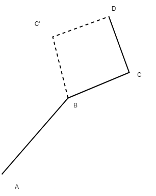

# Three-Link Planar Serial Manipulator Simulation

This is a simple simulation of a three-link planar serial manipulator.

## Installation

1. Clone the project \
    ```git clone https://github.com/sanjeevg15/robolink.git```
2. Install the dependencies \
    ```pip install -r requirements.txt```
3. If the above fails, please try installing the dependencies manually \
    ```pip install numpy``` \
    ```pip install pygame```

## Usage Documentation

Run the serial_manipulator_sim.py file \
 ```python main.py```\
Options:\
```python main.py --allow_negative_y``` to allow target locations for the end-effector to     be below the x-axis.\
```python main.py --optimization_algorithm box-search``` for box optimization using box-search (default and preferred). \
```python main.py --optimization_algorithm gradient-descent``` for gradient descent.\
```python main.py --wait_time 10``` for specifying wait time (in miliseconds) between frames. (default: 250) \
```python main.py --num_points 10``` for specifying the number of points to use for the box-search. (default: 100) \

## Organization

The project is organized as follows:

1. The main file is serial_manipulator_sim.py
2. optim.py contains the optimization code
3. utils.py contains utility/helper functions
4. readme.md contains the documentation

## Explanation

We are required to solve the Inverse Kinematics Problem for a planar three link serial manipulator. Since the end-effector has two degrees of freedom and we have three joint angles in our control, it is a redundant manipulator. For any point in R^2, there are infinitely many points in the joint space that can be used to reach that point. Hence, we are asked to choose that configuration which minimizes the maximum change in any joint angle

### Problem Formulation

We formulate this as a constrained optimization problem where the objective function is the maximum change in any joint angle and the constraints are:

1. The position of the end-effector should be equal to the target position.
2. The links should always lie completely above the x-axis.

In general, to solve such a an optimization problem (over three variables corresponding to the three joint angles), containing both equality as well as inequality constraints, we can use the Sequqntial Quadratic Programing Approach. However, this particular problem can be simplified to an unconstrained optimization over a single variable as follows:

1. Let x be the first joint angle (i.e. A-B)
2. This determines the position of the point B.
3. Now consider the 2-link manipulator B-C-D.
4. This manipulator has at most two solutions to the inverse kinematics problem which can be obtained analytically.
5. Hence, for every value of x, we can obtain all possible solutions for the last two joint angles.
6. For each of these solutions, we then calculate the maximum change in any joint angle.
7. Thus, we have converted the original problem into an unconstrained optimization problem over a single variable.
8. Constraints for the links to be above the x-axis:
   1. Since we can bound x to be in the range[0, pi], we can be certain that all configurations will have point B above the x-axis
   2. Point target point D has to be above the x-axis, otherwise the target point cannot be reached without some part of the link C-D being below the x-axis.
   3. Thus, the only point that can potentially be below the x-axis in some configurations is point C.
   4. These configurations can be avoided by simply returning a high value for the cost function at these configurations
9. To obtain the optimal x, I use two approaches:
   1. Box-search: In the case of this univariate optimization problem, this is simply a sweep over equally spaced points within the variable bounds.
   2. Gradient Descent: Gradient calculation is done numerically. However, this method requires hyper-parameter tuning and the time to convergence can vary greatly depending on the learning rate.
   3. Both these implementations can be found in the optim.py file.


